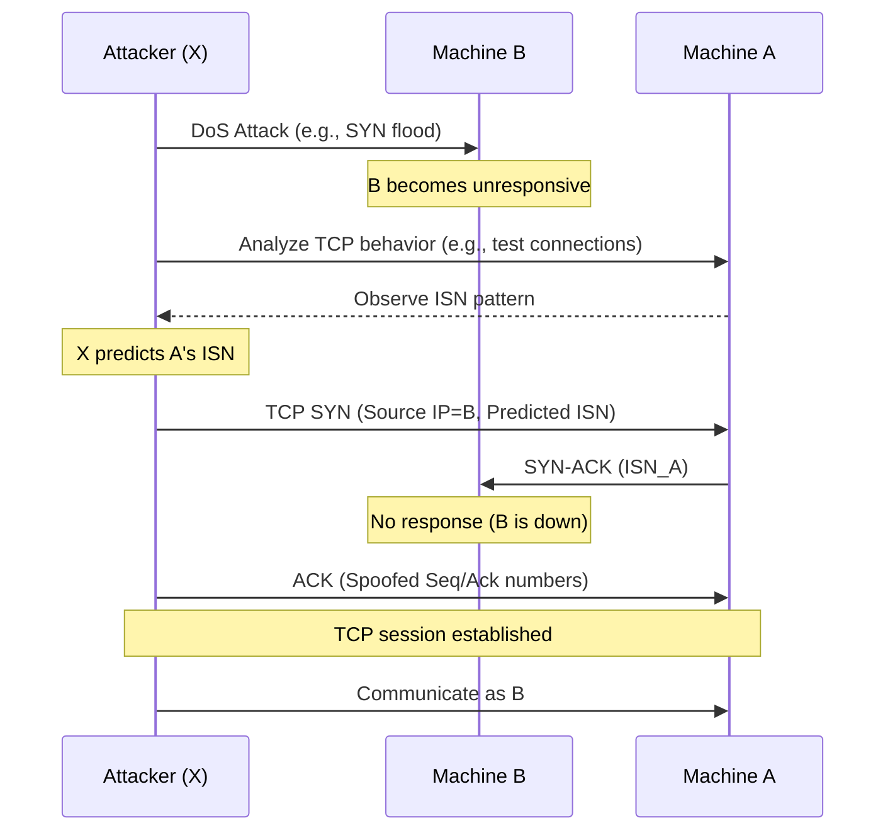

### **Exercice 03: IP Spoofing**

#### **1. What would happen if the pirate does not paralyze machine B?**

If the attacker (pirate) does not paralyze machine B:
- B remains active and responds to packets sent by A.
- When A sends packets to B’s IP (spoofed by the attacker), B may reply with TCP RST (reset) packets or unexpected sequence numbers, disrupting the attacker’s session.
- A detects the conflicting responses, potentially terminating the connection or triggering security alerts.
- The attack fails because B’s legitimate responses interfere with the attacker’s spoofed packets.

Paralyzing B (e.g., via DoS) ensures B cannot respond, allowing the attacker to impersonate B without interference.

#### **2. Why is it necessary to determine how A generates its ISN?**

The **Initial Sequence Number (ISN)** is used in TCP to track packet order and ensure reliable communication. To spoof B, the attacker must:
- Predict A’s ISN to craft valid TCP packets that A accepts as part of the session.
- Respond with correct sequence and acknowledgment numbers to maintain the TCP handshake and data transfer.
- If the ISN is unpredictable (e.g., random), the attacker’s packets are rejected, as they won’t match A’s expected sequence numbers.

Determining A’s ISN generation method (e.g., predictable increments or patterns) allows the attacker to guess the correct ISN and sustain the spoofed session.

#### **3. What could be the attacker’s motivation for impersonating machine B?**

The attacker’s goals may include:
- **Gain unauthorized access**: Impersonate B to access A’s services, data, or resources (e.g., login sessions, sensitive files).
- **Man-in-the-middle**: Intercept or modify communication between A and B.
- **Bypass security**: Trick A into trusting the attacker as B, evading authentication or access controls.
- **Execute commands**: Send malicious commands or data to A, exploiting B’s trusted status.
- **Cover tracks**: Frame B for malicious activities, deflecting blame.

#### **4. Represent the steps of the attack in a diagram.**

Below is a textual representation of the IP spoofing attack steps (since diagrams cannot be drawn directly). Assume the attacker is X, impersonating B to communicate with A.

**Diagram Explanation**:
- **Step 1**: X floods B with traffic (e.g., SYN flood) to make B unresponsive.
- **Step 2**: X observes A’s TCP packets (e.g., via sniffing or test connections) to predict ISN.
- **Step 3**: X initiates a TCP handshake with A, using B’s IP and predicted sequence numbers, completing the session as B.
